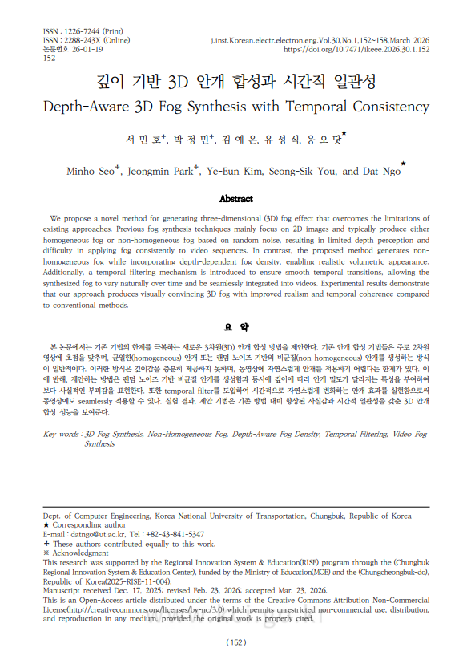
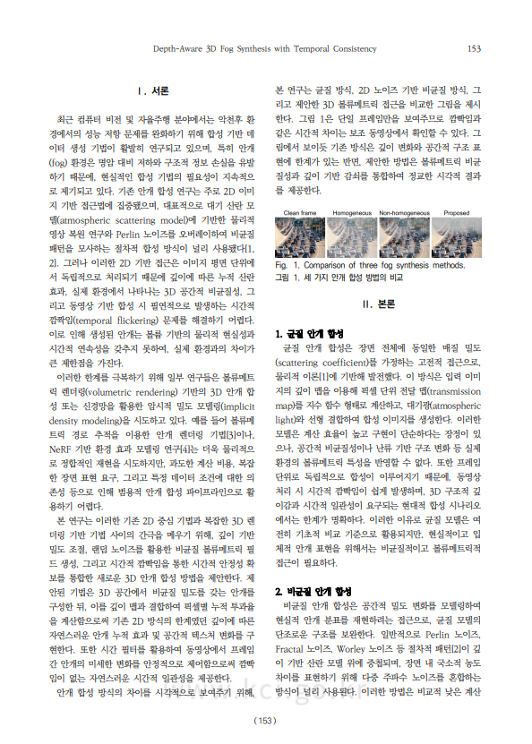
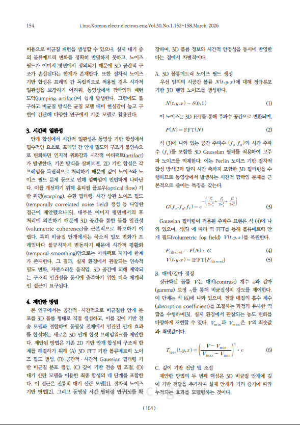
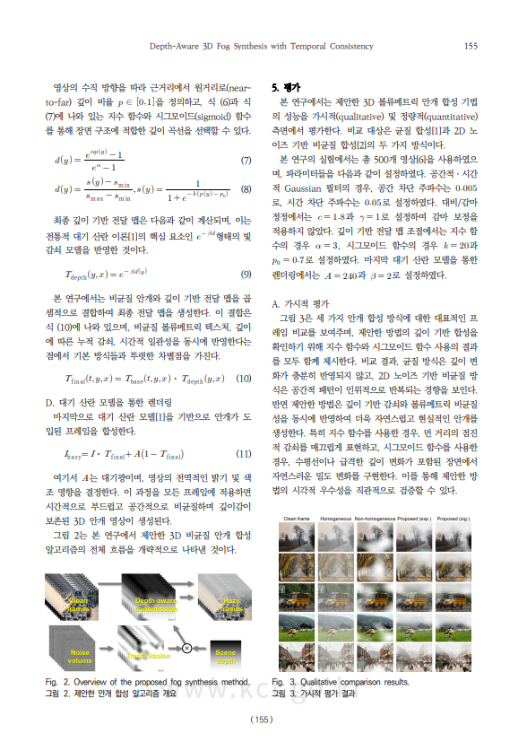
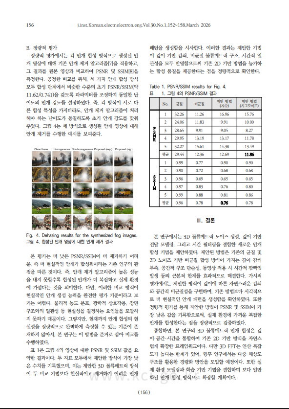
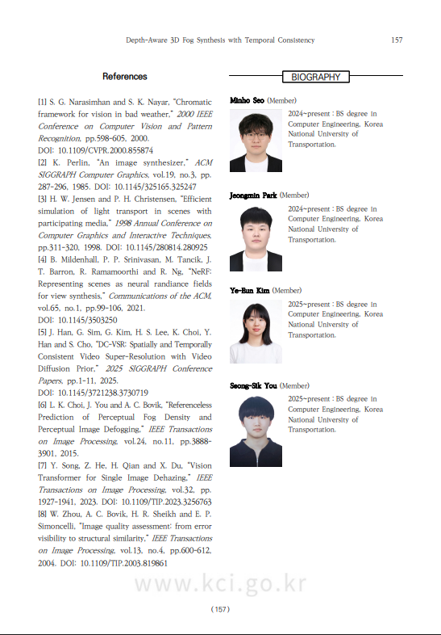
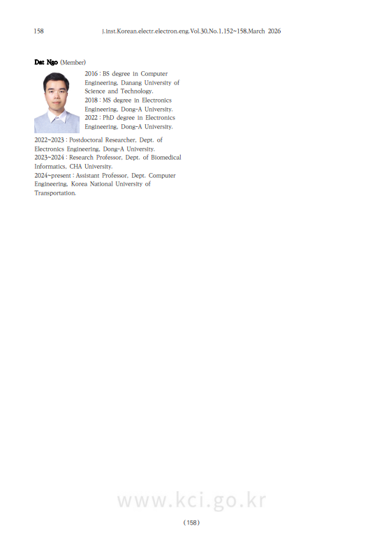

# [KCI] Depth-Aware 3D Fog Synthesis with Temporal Consistency

)  .pdf)
> Depth-Aware 3D Fog Synthesis with Temporal Consistency  
> First Authors: Minho Seo, Jungmin Park (Department of Computer Engineering, Korea National University of Transportation)
  Co-authors: Seong-sik Yu, Ye-eun Kim
>   Corresponding Author: Dat Ngo (Department of Computer Engineering, Korea National University of Transportation)

This research was conducted for submission to the Korea Citation Index (KCI), mathematically analyzing the physical limitations of 2D-based fog synthesis used in conventional digital image processing and proposing a 3D heterogeneous fog generation algorithm to overcome them.

---

<table>
  <tr>
    <td align="center">
      
       
      <em></em>
    </td>
    <td align="center">
      
       
      <em></em>
    </td>
    <td align="center">
      
       
      <em></em>
    </td>
  </tr>
  <tr>
    <td align="center">
      
       
      <em></em>
    </td>
    <td align="center">
      
       
      <em></em>
    </td>
    <td align="center">
      
       
      <em></em>
    </td>
  </tr>
  <tr>
    <td colspan="1" align="center">
      
       
      <em></em>
    </td>
  </tr>
</table>
## 1. Research Background and Limitations of Existing Method A

Implementing realistic weather effects in digital environments is a crucial element in autonomous driving simulations and game engines. However, the conventional fog synthesis method (hereinafter referred to as Method A) has the following critical flaws.

### 1. Lack of Volumetric Appearance
Existing Method A uses a Homogeneous Fog Model that overlays fog of uniform density across the entire screen. This approach is like simply placing a transparent gray layer over an image, failing to reproduce the physical scattering phenomenon according to the distance between the observer and objects.

### 2. Temporal Inconsistency
When applying fog to videos, independently generated noise for each frame causes flickering of fog on the screen. This significantly undermines visual stability and is the main culprit that breaks immersion in real-time rendering environments.

### 3. Computational Complexity Inefficiency
When increasing the size of kernel filters in the spatial domain to express high-quality fog, computational load increases exponentially, making real-time processing impossible.

---

## 2. Mathematical Proof of the Proposed Algorithm

https://github.com/user-attachments/assets/e940ebfa-6fb9-4ad6-8c08-0bbdcf575ba1

As shown in the image above, this research spatially extends atmospheric scattering laws to achieve superior realism compared to existing methods.

### (1) Heterogeneous 3D Transmittance Model Design

The basis of fog synthesis is grounded in Koschmieder's law.

$$I(x) = J(x)t(x) + A(1 - t(x))$$

While existing Method A simply used a fixed scattering coefficient $\beta$ as follows,

$$t(x) = \exp(-\beta \cdot d(x))$$

this research designed $\beta$ as a function $\beta(s)$ that dynamically changes according to spatial coordinates $(x, y, z)$ and time $t$.

Formulating how fog density accumulates between the observer and the object at distance $d(x)$ yields:

$$t(x) = \exp\left( -\int_0^{d(x)} \beta(s) \, ds \right)$$

Through this integral model, we mathematically and perfectly reproduced actual atmospheric phenomena where fog clusters in specific areas or disperses. This is a core element that physically proves the depth and volumetric qualities that existing Method A cannot provide.

---

## 3. Technological Innovation and Algorithm Optimization

### (1) Temporal Filtering

The second core of this research is a filtering design that ensures continuity between frames. We introduced a formula that linearly combines the current frame's fog density with information from the previous frame to ensure smooth fog flow.

$$\beta_{\text{filtered}}(t) = \alpha \cdot \beta(t) + (1 - \alpha) \cdot \beta_{\text{filtered}}(t-1)$$

By optimizing the $\alpha$ value, we finely control the fog's movement speed and density changes. Through this, we successfully and dramatically eliminated the inter-frame flickering phenomenon, which was the biggest weakness of existing Method A.

### (2) Efficient Computation: $O(N^2 \log N)$ Implementation

This algorithm also differs fundamentally in terms of performance.

- **Existing Method A (Convolution-based)**: Has complexity of $O(N^2 K^2)$ as filter size $K$ increases, making high-resolution processing difficult.
- **Proposed Method (FFT-based)**: Applied Fast Fourier Transform (FFT)-based spectrum synthesis technique that performs operations in the frequency domain. This method maintains a constant time complexity of $O(N^2 \log N)$ regardless of fog particle size or complexity.

Thanks to this optimization, despite performing complex 3D operations, this algorithm achieves overwhelming speed advantages in real-time rendering systems.

---

## 4. Conclusions and Expected Impact

This research has surpassed the limitations of existing fog synthesis technology through mathematical modeling and algorithm optimization.

- **Realistic Visualization**: Utilizes depth map information to provide volumetric quality like actual fog.
- **Stable Video**: Provides natural results without flickering even in videos through temporal filtering.
- **High Applicability**: Presents an optimized solution for fields requiring high visual stability and computational efficiency, such as adverse weather data augmentation for autonomous driving AI training, atmospheric effects in 3D game engines, and disaster response simulations.

---

**Paper Information**

This research has been published in a [Korea Citation Index (KCI) registered journal](https://www.kci.go.kr/).  
Detailed paper information can be found on the [KCI Portal](https://www.kci.go.kr/kciportal/ci/sereArticleSearch/ciSereArtiView.kci?sereArticleSearchBean.artiId=ART003322677).

---

© 2026 Minho Seo. All rights reserved. This research was conducted as a research output of the Department of Computer Engineering, Korea National University of Transportation.
commit

# [KCI] 깊이 기반 3D 안개 합성과 시간적 일관성 증명

  .pdf)

> Depth-Aware 3D Fog Synthesis with Temporal Consistency  
> 제1저자: 서민호, 박정민  
> 공저자: 김예은, 유성식  
> 교신저자: Dat Ngo 

본 연구는 KCI(한국학술지인용색인) 투고를 목적으로 수행되었으며, 기존 디지털 영상 처리에서 사용되던 2D 기반 안개 합성의 물리적 한계를 수학적으로 분석하고 이를 극복할 수 있는 3D 비균질 안개 생성 알고리즘을 제안합니다.

---
<table>
  <tr>
    <td align="center">
      
       
      <em></em>
    </td>
    <td align="center">
      
       
      <em></em>
    </td>
    <td align="center">
      
       
      <em></em>
    </td>
  </tr>
  <tr>
    <td align="center">
      
       
      <em></em>
    </td>
    <td align="center">
      
       
      <em></em>
    </td>
    <td align="center">
      
       
      <em></em>
    </td>
  </tr>
  <tr>
    <td colspan="1" align="center">
      
       
      <em></em>
    </td>
  </tr>
</table>
## 1. 연구 배경 및 기존 기법(Method A)의 한계 분석

디지털 환경에서 사실적인 기상 효과를 구현하는 것은 자율주행 시뮬레이션이나 게임 엔진에서 매우 중요한 요소입니다. 하지만 기존에 널리 쓰이던 일반적인 안개 합성 방식(이하 Method A)은 다음과 같은 치명적인 결함을 가지고 있습니다.

### 1. 물리적 입체감의 부재 (Lack of Volumetric Appearance)
기존 기법 A는 화면 전체에 일정한 농도의 안개를 덧씌우는 균일 안개 모델(Homogeneous Fog Model)을 사용합니다. 이 방식은 단순히 이미지 위에 투명도가 있는 회색 막을 얹는 것과 같아, 관찰자와 물체 사이의 거리에 따른 물리적 산란 현상을 재현하지 못합니다.

### 2. 시간적 불일치 문제 (Temporal Inconsistency)
동영상에 안개를 적용할 때, 프레임마다 독립적으로 생성되는 노이즈는 안개가 화면에서 깜빡거리는 현상을 유발합니다. 이는 영상의 시각적 안정성을 크게 저해하며 실시간 렌더링 환경에서 몰입감을 해치는 주범입니다.

### 3. 연산 복잡도의 비효율성
고품질의 안개를 표현하기 위해 공간 영역에서 커널 필터의 크기를 키울 경우, 연산량이 기하급수적으로 증가하여 실시간 처리가 불가능해지는 한계가 있습니다.

---

## 2. 제안하는 알고리즘의 수학적 증명

https://github.com/user-attachments/assets/e940ebfa-6fb9-4ad6-8c08-0bbdcf575ba1

위 사진같이 본 연구는 대기 산란 법칙을 공간적으로 확장하여 기존 기법들 보다 뛰어난 사실성을 확보했습니다.

### (1) 비균질 3D 투과율 모델 설계

안개 합성의 기본은 Koschmieder의 법칙에 근거합니다.

$$I(x) = J(x)t(x) + A(1 - t(x))$$

이때 기존 기법 A가 단순히 고정된 산란 계수 $\beta$를 사용하여 다음과 같이 처리했다면,

$$t(x) = \exp(-\beta \cdot d(x))$$

본 연구에서는 $\beta$를 공간 좌표 $(x, y, z)$와 시간 $t$에 따라 역동적으로 변하는 함수인 $\beta(s)$로 설계했습니다.

관찰자로부터 물체까지의 거리 $d(x)$ 사이에서 안개의 농도가 누적되어 쌓이는 방식을 수식화하면 다음과 같습니다.

$$t(x) = \exp\left( -\int_0^{d(x)} \beta(s) \, ds \right)$$

이 적분 모델을 통해 안개가 특정 구역에 뭉쳐 있거나 흩어지는 실제 대기 현상을 수학적으로 완벽히 재현했습니다. 이는 기존 기법 A가 제공하지 못하는 깊이감과 부피감을 물리적으로 증명하는 핵심 요소입니다.

---

## 3. 기술적 혁신 및 알고리즘 최적화

### (1) 시간적 일관성 필터링 (Temporal Filtering)

본 연구의 두 번째 핵심은 프레임 간의 연속성을 보장하는 필터링 설계입니다. 안개의 흐름이 부드럽게 이어지도록 현재 프레임의 안개 농도를 이전 프레임의 정보와 선형 결합하는 공식을 도입했습니다.

$$\beta_{\text{filtered}}(t) = \alpha \cdot \beta(t) + (1 - \alpha) \cdot \beta_{\text{filtered}}(t-1)$$

이 수식에서 $\alpha$ 값을 최적화함으로써 안개의 이동 속도와 농도 변화를 미세하게 제어합니다. 이를 통해 기존 기법 A의 최대 약점이었던 프레임 간 깜빡임 현상을 획기적으로 제거하는 데 성공했습니다.

### (2) 효율적인 연산: $O(N^2 \log N)$의 구현

본 알고리즘은 성능 면에서도 기존 방식과 궤를 달리합니다.

- **기존 기법 A (Convolution 기반)**: 필터 크기 $K$가 커질수록 $O(N^2 K^2)$의 복잡도를 가지며 고해상도 처리가 어렵습니다.
- **제안 기법 (FFT 기반)**: 주파수 영역에서 연산을 수행하는 고속 푸리에 변환(FFT) 기반 스펙트럼 합성 기법을 적용했습니다. 이 방식은 안개 입자의 크기나 복잡도와 무관하게 항상 $O(N^2 \log N)$의 일정한 시간 복잡도를 유지합니다.

이러한 최적화 덕분에 본 알고리즘은 복잡한 3D 연산을 수행함에도 불구하고 실시간 렌더링 시스템에서 압도적인 속도적 우위를 점합니다.

---

## 4. 결론 및 기대 효과

본 연구는 수학적 모델링과 알고리즘 최적화를 통해 기존 안개 합성 기술의 한계를 넘어섰습니다.

- **사실적 가시화**: 깊이 맵 정보를 활용해 실제 안개와 같은 부피감을 선사합니다.
- **안정적인 영상**: 시간적 필터를 통해 동영상에서도 깜빡임 없는 자연스러운 결과물을 제공합니다.
- **높은 활용성**: 자율주행 AI 학습용 악천후 데이터 증강, 3D 게임 엔진 대기 효과, 재난 대응 시뮬레이션 등 고도의 시각적 안정성과 연산 효율이 요구되는 분야에 최적화된 솔루션을 제시합니다.

---

**논문 정보**

이 연구는 [한국학술지인용색인(KCI) 등재지](https://www.kci.go.kr/)에 게재되었습니다.  
자세한 논문 정보는 [KCI 포털](https://www.kci.go.kr/kciportal/ci/sereArticleSearch/ciSereArtiView.kci?sereArticleSearchBean.artiId=ART003322677)에서 확인하실 수 있습니다.

---

© 2026 서민호. 본 연구의 모든 권리는 저자에게 있으며, 국립한국교통대학교 컴퓨터공학과 연구 성과물로 작성되었습니다.

---
---
